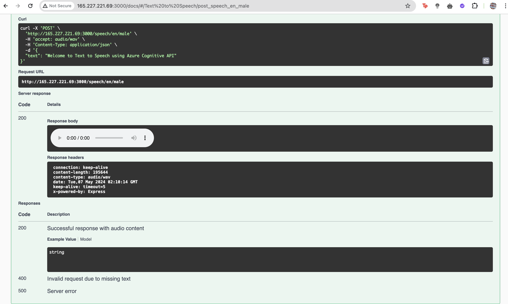
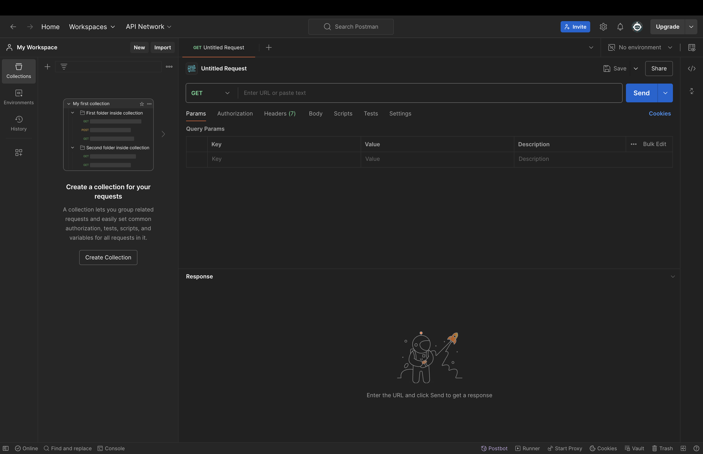
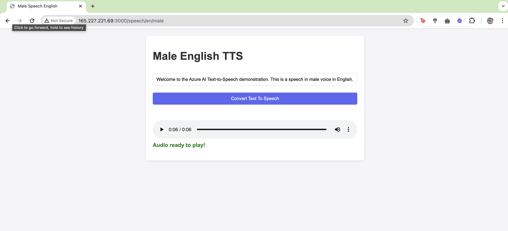

# SI 6177 Final Project - Azure AI Speech (TTS) API

System Integration (ITIS-6177) Final Project - Text To Speech Using Azure AI Speech (Spring 2024)

### Table of Contents

- [Why?](#why)
- [Built Using](#built-using)
- [Getting Started](#getting-started)
- [Sample Response](#sample-response)
- [Endpoints](#endpoints)
- [Response Codes](#response-codes)
- [Limitations](#limitations)
- [Thank you!](#thank-you)

## Why?

The goal of this project is to develop a simplified REST API for text-to-speech conversion using [Azure AI Speech](https://azure.microsoft.com/en-us/services/cognitive-services/text-to-speech/) service. This API aims to provide an accessible and easy-to-use interface for integrating text-to-speech functionality into various applications.

## Built Using

- [Node.js](https://nodejs.org/en)
- [Express](https://expressjs.com/)
- [Axios](https://axios-http.com/)
- [Swagger UI](https://swagger.io/tools/swagger-ui/)

## Getting Started

Let's get started with text-to-speech!

[Swagger](http://localhost:3000/docs/) documentation has been set up for this project and can be used to explore the API endpoints.

**Disclaimer - Swagger does not support audio output by default.**
Additionally the use the following UI that i created for testing the API.

Alternatively, you can follow the steps below to understand how to use the API.

### Prerequisites

- [Postman](https://www.postman.com/) or any similar API testing tool.

### Steps

1. Open Postman and create a new request.

2. Enter the base URL along with the desired [endpoint](#endpoints). Change the request type to POST.

3. Navigate to the Header section and add a header key "Content-Type" with value as "application/json" as shown below.

4. Navigate to Body section and select _raw_ format. Then, enter the text you want to convert to speech in JSON format. (Enter the text in the below format with text as the key and the text you want to convert in the form of value to the key "text")

4. Click Send and wait for the response.

5. You'll receive an audio file containing the speech based on the provided text.

## Sample Response

The response will be an audio file containing the speech generated from the input text.
I have pushed a sample audio file in the git repo, feel free to check it out, the file will be named [output.wav](https://github.com/yashwanthmn20/SI_6177_Final_Project_Azure_AI_Speech/blob/main/output.wav)

## Endpoints

**Base URL:** `http://localhost:3000`

| Method | Endpoint          | Description                            |
| :----: | :---------------- | :------------------------------------- |
|  POST  | /speech/en/male   | Convert text to male English speech.   |
|  POST  | /speech/en/female | Convert text to female English speech. |
|  POST  | /speech/es/female | Convert text to female Spanish speech. |

## Response Codes

| Code | Type         | Description                                        |
| :--: | :----------- | :------------------------------------------------- |
| 200  | OK           | Successful API call.                               |
| 400  | Bad Request  | The request is malformed or missing required data. |
| 500  | Server Error | An error occurred on the server side.              |

## Limitations

- The service supports only certain languages and accents for speech synthesis.
- File size and length limitations may apply based on the Azure AI Speech service plan.
- Limited number of API calls based on the Azure subscription tier.
- Swagger do not produce these audio files like we saw in POSTMAN, I am working on the workarounds to make the audio clip playable in Swagger. If you can see this comment here, that means Swagger may not play the audio output.

## Thank You
